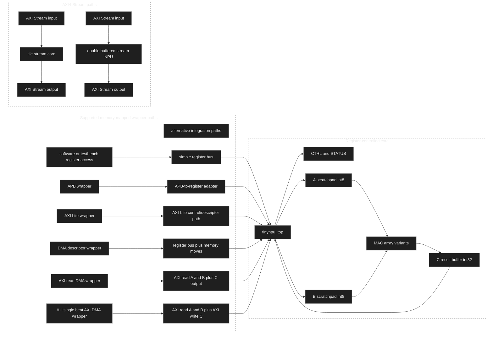
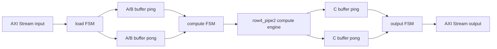

# tinyNPU

tinyNPU is a SystemVerilog RTL project for a fixed 4x4 signed int8 matrix
multiply accelerator. It includes a register-controlled core, APB/AXI-Lite/DMA
integration wrappers, timing-oriented MAC variants, local OpenLane/SKY130
ASIC-style flow experiments, and AXI4-Stream tile/streaming prototypes. This is
a local RTL and physical-flow exploration project, not a tapeout, signoff-clean
release, or production NPU.

## Key Features

- 4x4 signed int8 matrix multiply with signed int32 accumulation.
- Register-controlled `tinynpu_top` with A/B scratchpads and C result buffer.
- Selectable MAC variants: `serial`, `row4`, `row4_pipe`, `row4_pipe2`,
  `row4_pipe2_dupa`, `row4_pipe3`, and `full16`.
- APB wrapper, DMA descriptor wrapper, AXI4-Lite control wrapper, AXI read-DMA
  wrapper, and full single-beat AXI DMA wrapper.
- AXI4-Stream tile interface and double-buffered AXI4-Stream streaming NPU
  prototype.
- Self-checking simulations for core behavior, bus/control paths, DMA flows,
  stream handshakes, reset, backpressure, and signed edge values.
- Generic Yosys synthesis and documented OpenLane/SKY130 ASIC-style timing/PPA
  exploration.

## Architecture





## Current Status

| Area | Status |
| --- | --- |
| Register-controlled core | Verified by directed, control/status, bus, and deterministic random tests |
| APB / AXI-Lite / DMA wrappers | Verified by focused wrapper simulations |
| Full AXI DMA | Single-beat AXI reads for A/B and writes for C; no bursts or multiple outstanding transactions |
| ASIC-style flow | OpenLane/SKY130 runs completed and documented; no signoff-clean or tapeout claim |
| Streaming tile core | Tile-at-a-time AXI4-Stream subset verified |
| Streaming NPU | Double-buffered single-clock prototype verified in simulation |

## Core Architecture

The default core exposes a simple always-ready register bus:

- `CTRL` and `STATUS` registers for start, busy, done, and done-clear behavior.
- 16-entry int8 A scratchpad and 16-entry int8 B scratchpad.
- MAC array wrapper selecting the compile-time datapath variant.
- 16-entry int32 C result buffer.

The public register behavior is preserved across MAC variants. The scratchpads
and result buffer are standard-cell/register RTL in the current flows, not SRAM
macros.

## Interfaces And Wrappers

| Module | Purpose | Scope |
| --- | --- | --- |
| `tinynpu_top` | Register-controlled accelerator core | Simple bus, fixed 4x4 tile |
| `tinynpu_apb_wrapper` | APB-lite-style adapter | Wraps `tinynpu_top` |
| `tinynpu_dma_descriptor_wrapper` | Descriptor registers and DMA FSM | Abstract ready/valid memory port |
| `tinynpu_axi_lite_wrapper` | AXI4-Lite control path | Control only; memory port remains abstract |
| `tinynpu_axi_read_dma_wrapper` | AXI reads for A/B | C writes remain abstract |
| `tinynpu_axi_dma_wrapper` | Full single-beat AXI DMA | AXI reads for A/B and AXI writes for C |
| `tinynpu_axis_stream_tile_core` | AXI4-Stream tile interface | Load full A/B tile, compute, stream C |
| `tinynpu_axis_stream_npu` | Double-buffered stream prototype | Overlaps load, compute, and output where buffers permit |

The full AXI DMA wrapper intentionally uses single-beat transactions only:
`ARLEN/AWLEN = 0`, 32-bit data beats, no IDs, no bursts, and no multiple
outstanding transactions.

## ASIC / OpenLane Results

The OpenLane work is documented as ASIC-style RTL-to-GDS exploration using
SKY130. The 100 MHz target is aggressive exploration and is not closed.
`row4_pipe2` is the best balanced documented timing/PPA target, but no target is
signoff-clean because setup and/or electrical/antenna issues remain.

| Variant | Latency | Generic cells | 10 ns WNS/TNS | Setup viols | DRC/LVS | Notes |
| --- | ---: | ---: | ---: | ---: | --- | --- |
| `row4` | 26 cycles | 14,514 | -5.831 / -372.767 ns | 319 | clean / clean | Baseline four-lane row MAC |
| `row4_pipe` | 42 cycles | 15,026 | -1.901 / -45.687 ns | 178 | clean / clean | Product register stage |
| `row4_pipe2` tuned | 58 cycles | 15,198 | -0.343 / -1.588 ns | 21 | clean / clean | Best balanced 100 MHz attempt |
| `row4_pipe2_dupa` | 58 cycles | 15,198 | -0.314 / -1.716 ns | 16 | clean / clean | Lane-local selected-A experiment |
| `row4_pipe3` | 74 cycles | 11,966 | -0.260 / -0.469 ns | 4 | clean / clean | Better setup WNS, worse electrical/antenna profile |

Selected lower-clock row4_pipe2 runs also remain setup-negative: the documented
11.0 ns / 90.9 MHz run reports WNS/TNS -0.172 / -0.238 ns with 4 setup
violations, clean DRC/LVS, and clean antenna. See
[docs/asic_flow_results.md](docs/asic_flow_results.md) for full metrics and
limitations.

## Streaming NPU Results

The double-buffered streaming NPU uses the same packet format as the tile core:
16 row-major int8 A values, 16 row-major int8 B values, then 16 row-major int32
C values on the output stream. It is single-clock and simulation-verified, but
not a production NPU, CDC/multi-clock design, or ASIC-timing-optimized block.

| Metric | Value |
| --- | ---: |
| Single-tile latency | 156 cycles |
| Steady-state throughput | 64 cycles/tile |
| Observed input acceptance | 63 cycles/tile |
| Overlap observed | yes |
| Estimated throughput at 90 MHz | 1.40625M tiles/s, 90M MAC/s |
| Estimated throughput at 100 MHz | 1.5625M tiles/s, 100M MAC/s |

Throughput estimates are frequency-dependent arithmetic estimates from
simulation cycle counts: `tiles/s = f_clk / 64`, and each 4x4 tile is 64 MACs.

## Verification

| Area | Command | Coverage |
| --- | --- | --- |
| Core directed/random tests | `make sim` | Matrix correctness, register bus, control/status, reset, sticky done |
| APB wrapper | `make sim-apb` | APB access and forwarded core behavior |
| DMA descriptor wrapper | `make sim-dma-desc` | Descriptor FSM, memory backpressure, timeout/error handling |
| AXI-Lite wrapper | `make sim-axi-lite` | AXI-Lite control and descriptor access |
| AXI read-DMA | `make sim-axi-read-dma` | AXI read loading, RRESP/timeout paths |
| Full AXI DMA | `make sim-axi-dma` | AXI read/write backpressure, RRESP/BRESP, IRQ, timeout paths |
| AXI4-Stream tile core | `make sim-axis-stream` | Framing, stalls, output backpressure, reset, signed edge values |
| Double-buffered streaming NPU | `make sim-axis-stream-npu` | Back-to-back tiles, overlap, ping/pong isolation, reset, backpressure |
| Static repo checks | `make check` | Required files, syntax, generated vector shape, tool presence |
| ASIC scaffold checks | `make asic-check` | OpenLane config/source-list consistency |

## How To Run

Requirements: Python 3, Icarus Verilog (`iverilog`/`vvp`), Yosys, and `make`.
OpenLane runs require a separate OpenLane 2 Docker setup.

```sh
make help
make check
make sim
make sim-axi-dma
make sim-axis-stream
make sim-axis-stream-npu
make synth
make synth-row4-pipe2
make asic-check
```

Additional targets exist for APB, AXI-Lite, AXI read-DMA, MAC variants,
comparison snapshots, and generated vectors; `make help` lists the main entry
points.

## Limitations And Future Work

- No tapeout claim and no signoff-clean claim.
- 100 MHz remains an aggressive near-close exploration target, not a closed
  implementation.
- OpenLane results are local ASIC-style flow results, not shuttle/fab results.
- Scratchpads/result buffers are register-based RTL, not SRAM macros.
- Full AXI DMA is single-beat only; no bursts or multiple outstanding requests.
- Streaming NPU is a double-buffered single-clock prototype, not a production
  NPU or multi-engine streaming array.
- Streaming throughput estimates depend on clock frequency and are not timing
  closure claims.
- Future work: SRAM macro integration, deeper streaming queues, optional stream
  metadata, burst-capable AXI DMA, formal checks, and renewed ASIC timing work.

## Documentation

- [docs/source_manifest.md](docs/source_manifest.md): source and testbench map.
- [docs/asic_flow_results.md](docs/asic_flow_results.md): OpenLane/SKY130
  timing/PPA and limitations.
- [docs/streaming_core.md](docs/streaming_core.md): tile-at-a-time stream core.
- [docs/streaming_npu.md](docs/streaming_npu.md): double-buffered streaming NPU.
- [docs/results.md](docs/results.md): simulation and generic synthesis results.
